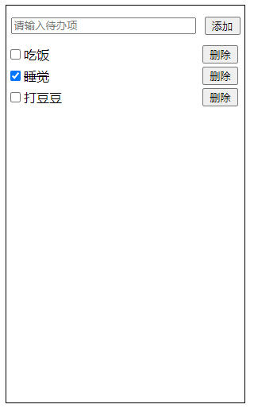

# TodoList
## 介绍
基于 React Hook + TypeScript 实现的基础 TodoList
## 效果演示

## 组件划分
    1. App 组件
    2. TodoList 组件
    3. 子组件
        - Input
        - List
            - index
            - Item
## 下载
```js
git clone git@github.com:JavanCheng/TodoList.git
```

## 使用

```js
npm i
npm start
```